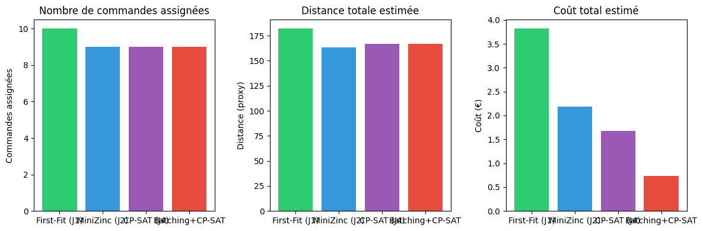

# Rapport Jour 4 — Allocation optimale et regroupement

**Projet OptiPick** | Ymen Nermine, Hamid, Romain

---

## Objectifs du Jour 4

- Optimiser l'allocation commandes → agents (pas seulement glouton).
- Grouper des commandes compatibles pour réduire la distance / le coût.

### Livrables

- Code avec optimisation complète (CP-SAT, batching).
- Comparaison quantitative des approches (First-Fit, MiniZinc, CP-SAT, Batching+CP-SAT).
- Métriques : distance (proxy), temps, coût.
- Graphiques de performance (optionnel, script `scripts/plot_day4_metrics.py`).

---

## 4.1 Modélisation CSP

L'allocation est modélisée comme un **problème de satisfaction de contraintes** :

### Variables

- **assign[order_i]** ∈ {0, 1, …, n_agents}  
  - 0 = commande non assignée  
  - j ≥ 1 = commande assignée à l’agent j  

En CP-SAT on utilise une matrice de variables binaires **x[i][j]** :  
x[i][j] = 1 si la commande i est assignée à l’agent j (j = 0 pour non assigné, j = 1..m pour les agents).

### Contraintes

1. **Capacité des agents**  
   Pour chaque agent j :  
   - Σ (poids des commandes assignées à j) ≤ capacité_poids(j)  
   - Σ (volume des commandes assignées à j) ≤ capacité_volume(j)  

2. **Incompatibilités**  
   Deux commandes dont les produits sont incompatibles ne peuvent pas être assignées au même agent :  
   pour chaque paire (i1, i2) incompatible et chaque agent j : x[i1][j+1] + x[i2][j+1] ≤ 1  

3. **Restrictions (zones, fragile, poids max)**  
   Pour chaque (commande i, agent j) : si la commande ne peut pas aller à l’agent (zone interdite, fragile, poids max item), alors x[i][j+1] = 0.  

4. **Chaque commande au plus une fois**  
   Pour chaque i : Σ_j x[i][j] = 1 (une commande est soit non assignée, soit assignée à exactement un agent).

### Objectif

- **Option "assign"** : maximiser le nombre de commandes assignées (comme MiniZinc).  
- **Option "cost"** : minimiser le coût total estimé (temps × coût horaire par agent).

**Fichier** : `src/allocation_cpsat.py`

---

## 4.2 Résolution avec OR-Tools CP-SAT

- **Variables** : x[i][j] BoolVar pour chaque (commande i, agent j avec j=0..m).  
- **Contraintes** : capacités (via AddMultiplicationEquality pour les termes poids/volume), incompatibilités, matrice allowed (zones, fragile, poids max).  
- **Objectif** : Maximize(sum des x[i][j] pour j≥1) ou Minimize(sum des coûts).  
- **Résolution** : `cp_model.CpSolver()`, avec `max_time_in_seconds` (défaut 30 s).

**Fonction principale** : `allocate_with_cpsat(orders, agents, products_by_id, warehouse, objective="assign"|"cost")`  
**Retour** : `{order_id: agent_id or None}`

---

## Annexe : Construction des paramètres pour le modèle MiniZinc

Quand on utilise MiniZinc (Jour 2 ou Jour 4 avec `--minizinc`), Python ne se contente pas d’appeler le solveur : il **construit toutes les données** attendues par le fichier `models/allocation.mzn`. Le modèle déclare des **paramètres** (entiers, tableaux, matrices) ; le code dans `src/minizinc_solver.py` les calcule à partir des objets Python (commandes, agents, produits, entrepôt) et les injecte dans l’instance MiniZinc.

### Ce que le modèle MiniZinc attend (allocation.mzn)

| Paramètre | Type MiniZinc | Rôle |
|-----------|----------------|------|
| `n_orders`, `n_agents` | `int` | Taille du problème |
| `capacity_weight`, `capacity_volume` | `array[AGENTS] of float` | Capacité de chaque agent |
| `agent_type` | `array[AGENTS] of int` | 0=robot, 1=humain, 2=chariot |
| `order_weight`, `order_volume` | `array[ORDERS] of float` | Poids et volume de chaque commande |
| `order_zones` | `array[ORDERS] of int` | Zone (0=A … 4=E) de la commande |
| `order_has_fragile` | `array[ORDERS] of bool` | La commande contient-elle du fragile ? |
| `order_max_item_weight` | `array[ORDERS] of float` | Poids max d’un article dans la commande |
| **`forbidden_zones`** | **`array[AGENTS, ZONES] of bool`** | **Matrice : agent × zone → true si zone interdite** |
| `no_fragile` | `array[AGENTS] of bool` | L’agent ne peut pas prendre de fragile |
| `max_item_weight` | `array[AGENTS] of float` | Poids max par article pour l’agent (0 = pas de limite) |
| **`incompatible`** | **`array[ORDERS, ORDERS] of bool`** | **Matrice : paire de commandes incompatible ?** |

Les deux **matrices** sont donc : **`forbidden_zones`** (agents × zones) et **`incompatible`** (commandes × commandes).

### Comment Python construit ces paramètres

- **Scalaires et vecteurs simples**  
  - `n_orders` = `len(orders)`, `n_agents` = `len(agents)`.  
  - `capacity_weight` / `capacity_volume` : une valeur par agent, lues depuis les objets `Agent`.  
  - `agent_type` : 0, 1 ou 2 selon `agent.type`.  
  - `order_weight` / `order_volume` : `order.total_weight` et `order.total_volume` (déjà calculés par `enrich_orders`).  
  - Pour chaque commande : zone (via `get_product_zone` sur les emplacements), présence de fragile (produits), poids max d’un item → remplissent `order_zones`, `order_has_fragile`, `order_max_item_weight`.  
  - `no_fragile` et `max_item_weight` : dérivés de `agent.restrictions` pour chaque agent.

- **Matrice `forbidden_zones` (agents × zones)**  
  - Pour chaque **agent** : lecture de `restrictions["no_zones"]` (ex. `["C"]`).  
  - Pour chaque zone A…E (indices 0…4), on met `True` si la zone est dans `no_zones`, sinon `False`.  
  - Résultat : une **ligne par agent**, 5 colonnes (une par zone).  
  - Exemple : robot avec `no_zones: ["C"]` → ligne `[False, False, True, False, False]`.

- **Matrice `incompatible` (commandes × commandes)**  
  - Pour chaque **paire de commandes** (i, j) : on récupère tous les produits des deux commandes.  
  - On appelle `can_combine(liste des produits)` (pas d’incompatibilité entre produits).  
  - Si les produits ne peuvent pas être combinés → `incompatible[i][j] = True`, sinon `False`.  
  - La diagonale est mise à `False` (une commande n’est pas incompatible avec elle-même).  
  - Résultat : matrice **n_orders × n_orders** de booléens.

Une fois ces listes/tableaux construits, Python fait :  
`instance["n_orders"] = n_orders`, `instance["forbidden_zones"] = forbidden_zones_matrix`, etc.  
L’**instance** MiniZinc contient donc le modèle + toutes ces données ; le solveur (ex. CBC) ne fait que résoudre ce problème paramétré. En résumé : **Python construit la matrice et tous les paramètres attendus par le modèle MiniZinc** à partir des JSON et du métier (zones, fragile, incompatibilités), puis envoie le tout au solveur.

---

## 4.3 Regroupement de commandes (Batching)

**Stratégie** (fichier `src/batching.py`) :

1. **Identifier les commandes compatibles**  
   - Même fenêtre de deadline (par défaut 60 min).  
   - Pas d’incompatibilités entre produits (utilisation de `can_combine`).  
   - Capacité du lot ≤ capacité max d’un agent (poids et volume).  

2. **Algorithme glouton**  
   - Tri des commandes par deadline.  
   - Pour chaque commande, tentative d’ajout au premier lot compatible (même fenêtre, capacité, pas d’incompatibilités).  
   - Sinon, création d’un nouveau lot.  

3. **Allocation des lots**  
   - Les lots sont alloués aux agents via `allocate_batches_with_cpsat(batches, agents, ...)`.  
   - Chaque lot est traité comme une méta-commande (poids/volume/locations agrégés).  
   - Une commande peut aller à un agent seulement si toutes les commandes du lot peuvent y aller (contraintes zones/fragile/poids max).  

**Structure** : `Batch(orders, total_weight, total_volume, unique_locations, deadline)`  
**Fonctions** : `build_batches(...)`, `allocate_batches_with_cpsat(...)`.

---

## Explication détaillée du batching

### Qu’est-ce que le batching ?

Le **batching** (regroupement en lots) consiste à **fusionner plusieurs commandes en un seul lot** avant de les assigner aux agents. Au lieu d’allouer commande par commande, on alloue des **lots** : chaque lot est une méta-commande (plusieurs commandes regroupées) qui sera préparée et livrée ensemble par un même agent.

**Idée** : regrouper des commandes qui ont des contraintes proches (même créneau de livraison, produits compatibles, capacité totale raisonnable) pour réduire le nombre de tournées ou mieux utiliser les agents.

### Pourquoi faire du batching ?

- **Moins de tournées** : un agent peut traiter plusieurs commandes en une seule tournée (même ensemble d’emplacements).
- **Meilleure utilisation des capacités** : on remplit mieux le poids/volume d’un agent en regroupant des commandes compatibles.
- **Respect des deadlines** : on ne regroupe que des commandes dont les deadlines sont dans une même fenêtre (ex. 60 min), pour que le lot soit livrable à temps.

### Les trois critères pour mettre des commandes dans le même lot

Une commande ne peut être ajoutée à un lot existant que si **tous** les critères suivants sont respectés :

1. **Fenêtre de deadline**  
   Les deadlines de toutes les commandes du lot (y compris la nouvelle) doivent rester dans un intervalle de **60 minutes** (paramètre `deadline_window_minutes`).  
   Ex. : commandes à livrer avant 10:00, 10:30 et 10:45 → OK ; une commande à 12:00 ne va pas dans ce lot.

2. **Capacité**  
   Le lot a un **poids total** et un **volume total** (somme des commandes). En ajoutant la nouvelle commande, le lot ne doit pas dépasser la capacité maximale d’un agent (ex. `max_batch_weight`, `max_batch_volume`, souvent la capacité du plus gros agent).  
   Sinon le lot ne pourrait être pris en charge par aucun agent.

3. **Pas d’incompatibilités**  
   Les **produits** de toutes les commandes du lot doivent être **compatibles entre eux** (fonction `can_combine` : pas de paires de produits avec `incompatible_with`).  
   Ex. : on ne met pas dans le même lot une commande avec un produit inflammable et une avec un produit incompatible.

### Algorithme : comment les lots sont construits

**Stratégie gloutonne** (dans `build_batches`) :

1. **Tri** des commandes par **deadline** (la plus tôt en premier).
2. Pour **chaque commande** (dans cet ordre) :
   - On parcourt les lots **déjà créés**.
   - On essaie d’**ajouter** la commande au **premier** lot qui reste compatible (fenêtre de deadline + capacité + pas d’incompatibilités).
   - Si un tel lot existe : on y ajoute la commande, on met à jour le poids/volume/emplacements/deadline du lot, et on passe à la commande suivante.
   - Si aucun lot n’est compatible : on **crée un nouveau lot** contenant uniquement cette commande.
3. À la fin, on obtient une **liste de lots** (`List[Batch]`). Chaque lot a :
   - `orders` : la liste des commandes du lot,
   - `total_weight` / `total_volume` : sommes des commandes,
   - `unique_locations` : tous les emplacements à visiter (sans doublon),
   - `deadline` : la deadline la plus stricte du lot (la plus tôt).

### Allocation des lots aux agents

Une fois les lots construits, on ne travaille plus au niveau **commande** mais au niveau **lot** :

- Chaque lot est vu comme une **méta-commande** : poids = `batch.total_weight`, volume = `batch.total_volume`.
- On appelle **`allocate_batches_with_cpsat(batches, agents, ...)`** : le solveur CP-SAT assigne chaque lot à un agent (ou le laisse non assigné), en respectant les capacités et les restrictions (zones, fragile, poids max). Pour un lot, l’agent doit accepter **toutes** les commandes du lot.
- Le résultat est une affectation **lot → agent**. On la **déplie** en affectation **commande → agent** : toutes les commandes d’un même lot reçoivent le même agent.

En résumé : **batching = regrouper les commandes compatibles (deadline, capacité, produits) en lots, puis allouer les lots aux agents** au lieu d’allouer les commandes une par une.

---

## 4.4 Comparaison des stratégies

Quatre stratégies sont comparées :

| Stratégie            | Description                          |
|----------------------|--------------------------------------|
| **first_fit**        | Allocation gloutonne (Jour 1)        |
| **minizinc**         | Allocation optimale MiniZinc (Jour 2)|
| **cpsat**            | Allocation CP-SAT (Jour 4)           |
| **batching_cpsat**   | Regroupement en lots + CP-SAT         |

### Métriques

- **Nombre de commandes assignées** (et non assignées).  
- **Distance totale (proxy)** : somme des distances entrée → emplacements par agent.  
- **Temps estimé** : Σ (distance/vitesse + 30 s × nombre de produits) par agent.  
- **Coût estimé** : Σ temps × (cost_per_hour / 3600) par agent.

### Exemple de sortie (test3 : 10 commandes, 3 agents)

```
  first_fit:
    Commandes assignées: 10 / 10
    Distance (proxy): 182 unités
    Temps estimé: 15.3 min
    Coût estimé: 3.82 €

  minizinc:
    Commandes assignées: 9 / 10
    Distance (proxy): 163 unités
    Temps estimé: 13.1 min
    Coût estimé: 2.18 €

  cpsat:
    Commandes assignées: 9 / 10
    Distance (proxy): 167 unités
    Temps estimé: 14.4 min
    Coût estimé: 1.68 €

  batching_cpsat:
    Commandes assignées: 9 / 10
    Distance (proxy): 167 unités
    Temps estimé: 14.8 min
    Coût estimé: 0.74 €
    Lots créés: 6
```

**Interprétation** : First-Fit assigne 10 commandes mais ne respecte pas toutes les contraintes (zones, fragile). MiniZinc, CP-SAT et Batching+CP-SAT respectent les contraintes et assignent 9 commandes. Le **batching** peut réduire le coût (0,74 €) en regroupant les commandes en 6 lots.

---

## Construction des paramètres pour le modèle MiniZinc

Le modèle `models/allocation.mzn` attend des **paramètres** et des **matrices** en entrée. Le code Python (`src/minizinc_solver.py`) les construit à partir des données du projet (commandes, agents, produits, entrepôt), puis les injecte dans l’instance MiniZinc via `instance["nom_param"] = valeur`.

### Ce que le modèle attend (déclarations dans `allocation.mzn`)

| Paramètre | Type MiniZinc | Rôle |
|-----------|----------------|------|
| `n_orders`, `n_agents` | `int` | Tailles du problème |
| `capacity_weight`, `capacity_volume` | `array[AGENTS] of float` | Capacité de chaque agent |
| `agent_type` | `array[AGENTS] of int` | 0=robot, 1=human, 2=cart |
| `order_weight`, `order_volume` | `array[ORDERS] of float` | Poids et volume de chaque commande |
| `order_zones` | `array[ORDERS] of int` | Zone de la commande (0=A … 4=E) |
| `order_has_fragile` | `array[ORDERS] of bool` | La commande contient-elle du fragile ? |
| `order_max_item_weight` | `array[ORDERS] of float` | Poids max d’un item dans la commande |
| **`forbidden_zones`** | **`array[AGENTS, ZONES] of bool`** | **Matrice : agent × zone → true si zone interdite** |
| `no_fragile` | `array[AGENTS] of bool` | L’agent ne peut pas prendre de fragile |
| `max_item_weight` | `array[AGENTS] of float` | Poids max par item (0 = pas de limite) |
| **`incompatible`** | **`array[ORDERS, ORDERS] of bool`** | **Matrice : paire de commandes → true si incompatibles** |

### Comment Python construit ces paramètres

1. **Scalaires et vecteurs “simples”**  
   - `n_orders` = `len(orders)`, `n_agents` = `len(agents)`.  
   - `capacity_weight` / `capacity_volume` : une valeur par agent (listes Python).  
   - `order_weight` / `order_volume` : une valeur par commande (déjà calculées dans `order.total_weight` / `total_volume`).  
   - `order_zones` : pour chaque commande, on prend les emplacements de la commande, on détermine la zone via `get_product_zone(warehouse, location)`, on convertit en entier avec `zone_to_int` (A→0 … E→4).  
   - `order_has_fragile` : pour chaque commande, on regarde si un des produits est `fragile`.  
   - `order_max_item_weight` : max des poids des produits de la commande.

2. **Matrice `forbidden_zones` (agents × zones)**  
   - C’est une **matrice booléenne** de taille `n_agents × 5` (5 zones A…E).  
   - Pour chaque agent, on lit `restrictions["no_zones"]` (ex. `["C"]`).  
   - On crée une liste de 5 booléens : `[False, False, False, False, False]`, puis pour chaque zone interdite on met `True` à l’index correspondant (ex. C → index 2).  
   - On obtient une liste de listes : `[ligne_agent_1, ligne_agent_2, ...]`, où chaque ligne = 5 booléens (zone autorisée ou interdite pour cet agent).

3. **Matrice `incompatible` (commandes × commandes)**  
   - C’est une **matrice booléenne** de taille `n_orders × n_orders`.  
   - Pour chaque paire de commandes (i, j), on récupère les produits des deux commandes et on appelle `can_combine(produits_i + produits_j)` (compatibilité via `incompatible_with` dans les produits).  
   - Si les produits ne peuvent pas être combinés → `incompatible[i][j] = True`.  
   - La diagonale est à `False` (une commande n’est pas incompatible avec elle-même).

Une fois toutes ces listes/matrices construites, on fait :  
`instance["forbidden_zones"] = forbidden_zones_matrix`,  
`instance["incompatible"] = incompatible_matrix`,  
etc. MiniZinc reçoit ainsi une **instance concrète** (taille + données) du modèle générique `allocation.mzn`, qu’il peut résoudre.

---

## Utilisation

### Lancer la comparaison Jour 4

```bash
# Données complètes
python main.py --day4

# Avec jeu de test (10 commandes, 3 agents différents)
python main.py --test3 --day4

# Inclure MiniZinc dans la comparaison (sinon inclus si la lib est installée)
python main.py --test3 --day4 --minizinc

# Choisir le solveur MiniZinc (cbc par défaut)
python main.py --test3 --day4 --minizinc --solver cbc
```

### Voir les graphiques de performance

Les graphiques sont dans **`results/day4_comparison.png`**. Pour les générer :

1. Après une comparaison Jour 4 (qui crée `results/day4_metrics.json`), exécuter :  
   `python scripts/plot_day4_metrics.py`
2. Si besoin : `pip install matplotlib`
3. Ouvrir le fichier `results/day4_comparison.png` (Finder, Cursor, ou `open results/day4_comparison.png`)

Exemple de sortie terminal :

```
python scripts/plot_day4_metrics.py
Graphique enregistré : /Users/romain/Desktop/forge/optipick/results/day4_comparison.png
```

**Graphiques de performance (Jour 4) :**



### Fichiers générés

- **results/day4_metrics.json** : métriques par stratégie (sans les affectations détaillées).
- **results/day4_comparison.png** — **Graphiques de performance** : 3 graphiques en barres (commandes assignées, distance proxy, coût en €). Pour les générer :
  1. Lancer une comparaison pour créer les métriques : `python main.py --test3 --day4` (ou `--minizinc --solver cbc`).
  2. Installer matplotlib si besoin : `pip install matplotlib`.
  3. Lancer le script : `python scripts/plot_day4_metrics.py`.
  4. Ouvrir le fichier **`results/day4_comparison.png`** (dans l’explorateur de fichiers ou avec `open results/day4_comparison.png` sur macOS).

---

## Fichiers créés / modifiés (Jour 4)

| Fichier                    | Rôle                                      |
|---------------------------|-------------------------------------------|
| `src/allocation_cpsat.py` | Modèle CSP et résolution CP-SAT (ordre et lots) |
| `src/batching.py`         | Regroupement en lots (deadline, capacité, incompatibilités) |
| `src/day4_comparison.py`  | Comparaison des stratégies et calcul des métriques |
| `main.py`                 | Option `--day4` et enregistrement des métriques |
| `scripts/plot_day4_metrics.py` | Graphiques à partir de `day4_metrics.json` |

---

*Rapport généré pour le Jour 4 — Projet OptiPick*
