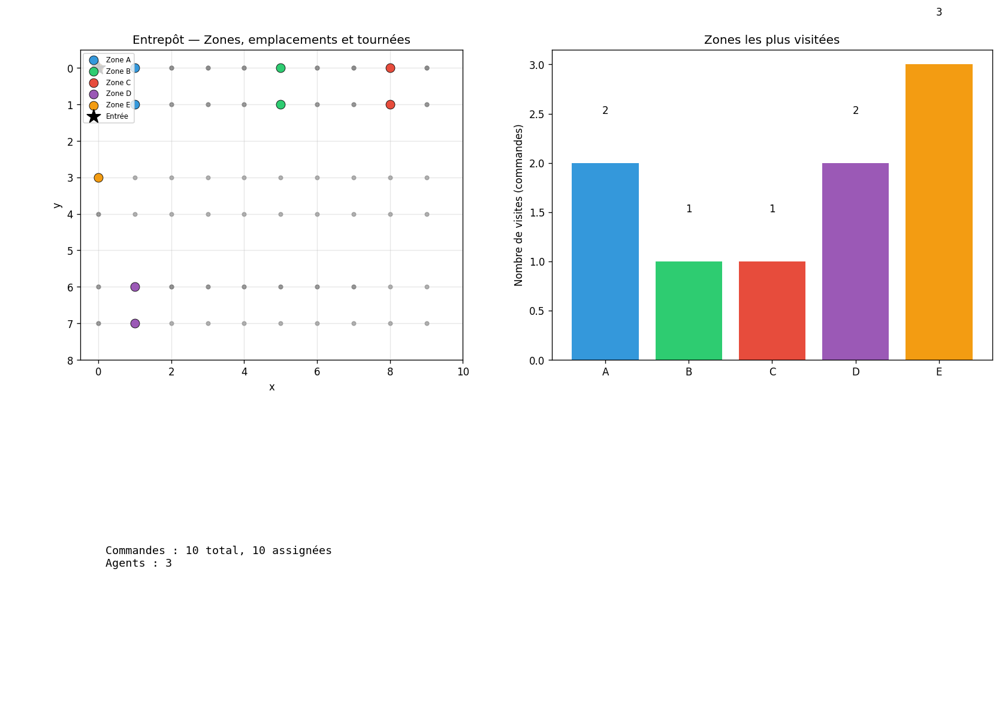

# Rapport Jour 5 — Optimisation du stockage et analyse avancée

**Projet OptiPick**

---

## Objectifs du Jour 5

- Réorganiser l'entrepôt pour améliorer les performances futures.
- Analyse de données et recommandations.

### Livrables

- **Proposition de réorganisation de l'entrepôt** : `results/day5_placement.json`
- **Résultats de simulation avant/après** : `results/day5_simulation.json`
- **Dashboard de visualisation** : `results/day5_dashboard.png`

---

## 5.1 Analyse des patterns de commandes

À partir de l'historique des commandes :

- **Produits les plus commandés** : fréquence par produit (nombre de commandes contenant ce produit).
- **Paires de produits souvent commandées ensemble** : co-occurrence dans les commandes (affinité).
- **Zones les plus visitées** : pour chaque commande, on détermine les zones des emplacements visités ; on compte combien de commandes visitent chaque zone.

**Fichier** : `src/day5_patterns.py`  
**Sortie** : `results/day5_patterns.json` (top produits, top paires, zone_visits).

---

## 5.2 Optimisation du stockage

Proposition de réorganisation selon trois règles :

### Règle 1 : Produits fréquents près de l'entrée

- Calcul de la fréquence de chaque produit (nombre de commandes).
- Les **20 % des produits les plus fréquents** (hors food/chemical) sont placés dans les emplacements les **plus proches de l'entrée** (zone A / zone proche).

### Règle 2 : Grouper produits souvent co-commandés

- Calcul des **affinités** entre produits (nombre de commandes où la paire apparaît ensemble).
- Les produits à forte affinité sont placés dans des emplacements **voisins** (même zone ou slots flexibles proches).  
  *(Dans l’implémentation actuelle, la répartition par zone et par fréquence prime ; un raffinement possible est de réordonner les slots pour rapprocher les paires à forte affinité.)*

### Règle 3 : Contraintes de zones

- **Alimentaire** → reste en zone réfrigérée **C**.
- **Chimie** → reste en zone séparée **D**.

**Fichier** : `src/day5_storage.py`  
- `compute_optimized_placement(orders, products_by_id, warehouse)` → `{product_id: Location}`  
- `build_optimized_products(products_by_id, new_placement)` → nouveau `products_by_id` avec emplacements optimisés.  
**Sortie** : `results/day5_placement.json` (mapping produit → [x, y]).

---

## 5.3 Simulation avant/après

- **Génération** de 50 commandes test (échantillonnage aléatoire parmi les produits, seed=42).
- **Simulation avec stockage actuel** : enrichissement des commandes avec les emplacements actuels, allocation (First-Fit), calcul de la **distance totale (proxy)**.
- **Simulation avec stockage optimisé** : mêmes commandes avec les emplacements de `day5_placement`, même allocation, calcul de la distance.
- **Comparaison** : distance actuelle vs optimisée, réduction en %.

**Fichier** : `src/day5_simulation.py`  
**Sortie** : `results/day5_simulation.json` (distance_current, distance_optimized, reduction_percent, n_assigned_*).

---

## 5.4 Analyse coopération humain–robot

- **Part des commandes** traitées par robots, humains et chariots (%).
- **Profil des commandes** par type d’agent (nombre d’items, poids moyen, etc.).
- **Recommandations** :
  - Faut-il acheter plus de robots ?
  - Quels types de produits automatiser en priorité ?
  - Comment former les humains pour les tâches à plus forte valeur ?

**Fichier** : `src/day5_human_robot.py`  
- `agent_type_stats(assignment, agents)`  
- `recommend(assignment, orders, agents)` → stats + recommandations texte.  
**Sortie** : `results/day5_human_robot.json`.

---

## 5.5 Dashboard de monitoring

Visualisation (matplotlib) :

- **Carte de l'entrepôt** : zones (A, B, C, D, E), point d’entrée, emplacements des produits.
- **Tournées des agents** : trajets (si `--routing` est activé et OR-Tools disponible).
- **Heatmap des zones visitées** : nombre de commandes ayant visité chaque zone.
- **Statistiques** : nombre de commandes, assignations, etc.

**Fichier** : `src/day5_dashboard.py`  
**Sortie** : `results/day5_dashboard.png`.

---

## Utilisation

### Lancer le pipeline Jour 5

```bash
python main.py --day5
```

Données par défaut : `data/warehouse.json`, `data/products.json`, `data/agents.json`, `data/orders.json`.

### Avec jeu de test (10 commandes, 3 agents différents)

```bash
python main.py --day5 --test3
```

*(Utilise `data/test_orders_10.json` et `data/test_agents_3diff.json`.)*

### Avec optimisation des tournées (TSP) dans le dashboard

```bash
python main.py --day5 --routing
```

*(Nécessite OR-Tools : `pip install ortools`.)*

### Exemple de sortie (début de l’analyse)

```
python main.py --day5 --routing
🔧 Jour 5 — Optimisation du stockage et analyse avancée

5.1 — Analyse des patterns
  Top produits (fréquence): [('Product_089', 4), ('Product_071', 3), ('Product_093', 3), ('Product_050', 3), ('Product_026', 2)]
  Zones visitées: {'D': 7, 'E': 5, 'A': 4, 'B': 3, 'C': 4}
  📁 results/day5_patterns.json

5.2–5.3 — Réorganisation et simulation (50 commandes test)
  Distance actuelle: 1052 | optimisée: 1098
  Réduction: -4.37 %
  📁 results/day5_placement.json, results/day5_simulation.json

5.4 — Coopération humain–robot
  robot: 18 commandes (60.0%)
  human: 10 commandes (33.3%)
  cart: 2 commandes (6.7%)
  → Répartition actuelle équilibrée. Analyser les pics de charge pour ajuster la flotte.
  → Automatiser en priorité les commandes à peu de lignes, poids modéré et priorité standard, où les robots sont les plus efficaces.
  → Former les humains aux commandes express, fragiles ou à forte valeur, et à la supervision des robots.
  📁 results/day5_human_robot.json
```

### Dashboard Jour 5 (exemple)



### Fichiers générés

| Fichier | Description |
|--------|-------------|
| `results/day5_patterns.json` | Top produits, top paires co-commandées, zone_visits |
| `results/day5_placement.json` | Proposition de réorganisation (produit → [x, y]) |
| `results/day5_simulation.json` | Métriques simulation avant/après (distances, réduction %) |
| `results/day5_human_robot.json` | Stats par type d’agent et recommandations |
| `results/day5_dashboard.png` | Dashboard (carte, heatmap, stats) |

---

## Fichiers créés / modifiés (Jour 5)

| Fichier | Rôle |
|---------|------|
| `src/day5_patterns.py` | Analyse des patterns (fréquence, paires, zones) |
| `src/day5_storage.py` | Optimisation du stockage (règles 1–3, placement) |
| `src/day5_simulation.py` | Simulation avant/après (50 commandes, comparaison) |
| `src/day5_human_robot.py` | Analyse humain–robot et recommandations |
| `src/day5_dashboard.py` | Dashboard (carte, tournées, heatmap) |
| `main.py` | Option `--day5` et enchaînement du pipeline |

---

*Rapport généré pour le Jour 5 — Projet OptiPick*
